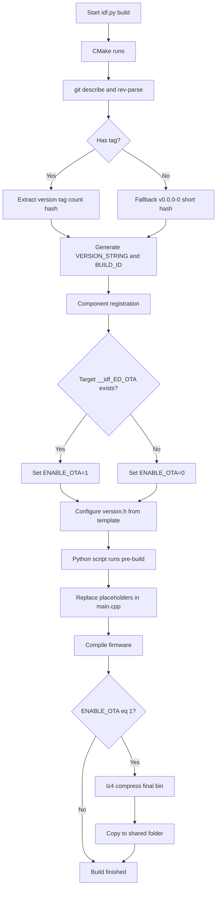
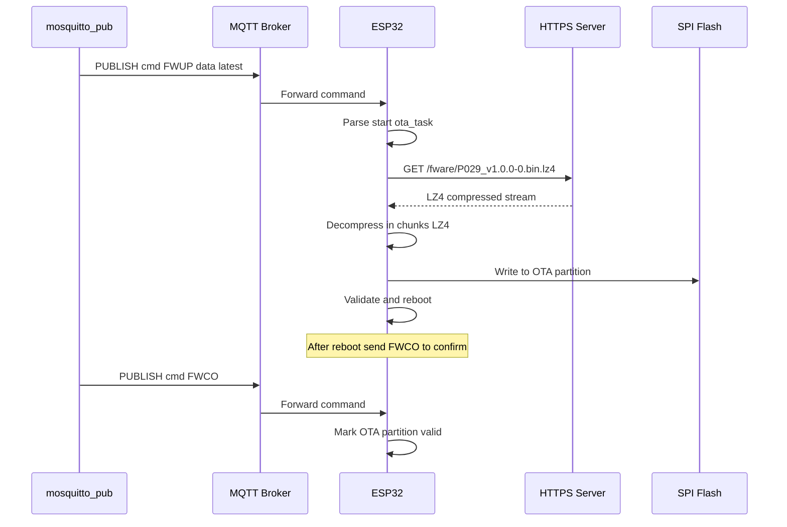

# OTA Firmware Update Workflow for ESP‑IDF Projects

> **Reference**
> This documentation was developed through an extended conversation with DeepSeek.
> You can view the full discussion here:
> [https://chat.deepseek.com/a/chat/s/23d38e69-d7f2-4a4a-94f7-7fa3c7ca75cf](https://chat.deepseek.com/a/chat/s/23d38e69-d7f2-4a4a-94f7-7fa3c7ca75cf)

This document describes the **fully automatic OTA (Over‑The‑Air) update system** implemented in the project. The system automatically:

- Injects **git version information**, **build ID**, and **git hashes** into the firmware.
- Detects whether the `ED_OTA` component is actually **linked** into the final binary (directly or indirectly) and **conditionally** compresses the binary with LZ4 and copies it to a shared folder.
- Uses **CMake** and a **Python helper script** to keep the source code clean (placeholders are replaced at build time).
- No manual `menuconfig` steps – detection is based on the actual build dependencies, making it fully automatic and version‑controlled.

The **device‑side OTA logic** is triggered via **MQTT commands** (JSON format on the `cmd` topic). This document explains both the **build‑time pipeline** and the **run‑time OTA flow**.

---

## Table of Contents

1. [Architecture Overview](#architecture-overview)
2. [Project Structure](#project-structure)
3. [Build Workflow (Step‑by‑Step)](#build-workflow-step-by-step)
4. [Version Injection into `main.cpp`](#version-injection-into-maincpp)
5. [OTA Post‑Build Compression & Deployment](#ota-post-build-compression--deployment)
6. [MQTT Commands & Triggering (Device Side)](#mqtt-commands--triggering-device-side)
7. [Configuration & Customisation](#configuration--customisation)
8. [Troubleshooting](#troubleshooting)

---

## Architecture Overview

The system is split into two parts:

- **Build‑time (host)**:
  - CMake extracts git metadata, generates `version.h`, and (if the `ED_OTA` component is part of the build) compresses the final `.bin` with LZ4 and copies it to a network share.
  - A Python script runs before compilation to replace placeholder strings in `main.cpp` with the actual values from `version.h`. This keeps the source file readable (placeholders like `"v0.0.0-0-dirty"`) while ensuring the firmware contains the correct version.

- **Run‑time (device)**:
  - The `ED_OTA` component uses HTTPS + LZ4 streaming to download the compressed firmware from a web server.
  - MQTT commands (`FWUP`, `FWCO`, `FWQS`) control the update process.

The following diagram shows the **build‑time pipeline**:



The **device‑side OTA update flow** is:



---

## Project Structure

Key files and their roles:

| File / Directory | Purpose |
|------------------|---------|
| `CMakeLists.txt` (root) | Detects project name from folder prefix (`P029_kiln` → `P029`). Runs the Python version‑injection script as a pre‑build step. Defines OTA post‑build compression (if `ENABLE_OTA=1`). |
| `main/CMakeLists.txt` | Git version extraction (handles tagged and untagged commits). Generates `version.h` from `version.h.in`. Registers the component **without** `COMPILE_DEFINITIONS` (to avoid a CMake parsing bug). Uses `target_compile_definitions` after registration to set `ENABLE_OTA`. **Detects OTA usage by checking `if(TARGET __idf_ED_OTA)`** – this catches both direct and indirect dependencies. |
| `main/version.h.in` | Template for `version.h`. Contains `@FW_...@` placeholders replaced by CMake. Uses `#cmakedefine ENABLE_OTA 1` to optionally define the macro. |
| `tools/update_version_comment.py` | Python script that reads the generated `build/main/version.h` and replaces the placeholder strings in the `GIT_fwInfo` struct inside `main.cpp`. Runs before every build. |
| `components/ED_OTA/` (submodule) | Contains `ED_OTA.h` and `ED_OTA.cpp` – the OTA update logic (HTTPS + LZ4 streaming, MQTT command handlers). |
| `main/main.cpp` | Contains the `GIT_fwInfo` struct with **literal placeholder strings**. These are replaced by the Python script at build time. The struct is used by other modules to access version information. |

---

## Build Workflow (Step‑by‑Step)

### 1. Project name detection (root CMakeLists.txt)

The folder name (e.g. `P029_kiln`) is read, and the part before the first underscore is extracted (`P029`). This becomes `PROJECT_NAME`. It is used for the output binary and the compressed file name.

```cmake
get_filename_component(CURRENT_FOLDER_NAME ${CMAKE_CURRENT_SOURCE_DIR} NAME)
string(REGEX REPLACE "^([^_]+).*" "\\1" PROJECT_PREFIX "${CURRENT_FOLDER_NAME}")
if(PROJECT_PREFIX MATCHES "^P[0-9][0-9][0-9]")
    set(PROJECT_NAME "${PROJECT_PREFIX}")
endif()
```

### 2. Git version extraction (main/CMakeLists.txt)

- `git describe --tags --long --dirty --always` and `git rev-parse HEAD` are executed.
- The output is parsed:
  - If a tag like `v1.2.3-...` exists → `VERSION_STRING = "v1.2.3-4"` (or `-dirty`).
  - If no tag (e.g., `138a497-dirty`) → fallback: `VERSION_STRING = "v0.0.0-0"` (or `-dirty`), and `GIT_SHORT_HASH` is set to `g138a497`.
- `BUILD_ID` is generated: `P{timestamp}-{short_hash_without_g}` (e.g., `P20250430-143022-138a497`).

The parsing logic in `main/CMakeLists.txt` is robust and handles both tagged and untagged commits:

```cmake
if(GIT_DESCRIBE MATCHES "^v([0-9.]+)-(.*)-(\\d+)-(g[0-9a-f]+)(-dirty)?$")
    # tagged case
    ...
else()
    # untagged fallback
    set(VERSION_BASE "0.0.0")
    set(COMMIT_COUNT "0")
    set(GIT_TAG "untagged")
    string(REGEX REPLACE "^([a-f0-9]+)(-dirty)?$" "\\1" GIT_SHORT_HASH "${GIT_DESCRIBE}")
    ...
endif()
```

### 3. OTA detection using CMake target existence

After `idf_component_register`, the `ED_OTA` component (if it is part of the build – either directly required by `main` or indirectly through another component) creates a CMake target named `__idf_ED_OTA`. This is the **most reliable** way to know whether the OTA code will be linked into the final binary. It works for both direct and indirect dependencies, and does not require scanning source files.

```cmake
# After idf_component_register
if(TARGET __idf_ED_OTA)
    set(ENABLE_OTA 1)
    message(STATUS "OTA component is linked → LZ4 compression will run after build")
else()
    set(ENABLE_OTA 0)
    message(STATUS "OTA component not linked → skipping post‑build steps")
endif()
```

### 4. Generate `version.h`

`configure_file` processes `main/version.h.in`, replacing all `@VAR@` placeholders with the current values. The resulting `version.h` is placed in `build/main/version.h`. It defines macros like `FW_GIT_VERSION`, `FW_GIT_TAG`, `FW_GIT_HASH`, `FW_FULL_HASH`, `FW_BUILD_ID`, and optionally `ENABLE_OTA` (via `#cmakedefine`).

### 5. Component registration

To avoid a CMake parsing bug where `COMPILE_DEFINITIONS` is misinterpreted as a directory, the `idf_component_register` call does **not** include that keyword. Instead, `target_compile_definitions` is used **after** registration:

```cmake
idf_component_register(
    SRCS "main.cpp" "$ENV{ESP_HEADERS}/x509_crt_bundle.S"
    INCLUDE_DIRS "." ${CMAKE_CURRENT_BINARY_DIR}
    REQUIRES ED_WIFI ED_MQTT diag ED_S_JSON
)

target_compile_definitions(${COMPONENT_TARGET} PRIVATE ENABLE_OTA=${ENABLE_OTA})
```

### 6. Python pre‑build script (root CMakeLists.txt)

The script `tools/update_version_comment.py` is set to run **before every build** using a custom target. It reads the generated `version.h` and replaces the literal placeholder strings in `main.cpp` with the actual values. This ensures the firmware always contains up‑to‑date version information while keeping the source file clean.

```cmake
find_package(Python3 REQUIRED)
add_custom_target(
    inject_version_before_build
    COMMAND ${Python3_EXECUTABLE} ${CMAKE_SOURCE_DIR}/tools/update_version_comment.py
    WORKING_DIRECTORY ${CMAKE_SOURCE_DIR}
    COMMENT "Injecting current git version into main.cpp"
    VERBATIM
)
add_dependencies(${CMAKE_PROJECT_NAME}.elf inject_version_before_build)
```

### 7. OTA post‑build compression (root CMakeLists.txt)

If `ENABLE_OTA` is set to `1` (meaning the `ED_OTA` component is linked), the final firmware binary is compressed with LZ4 and copied to the shared folder (`//raspi00/fware/`). The target `gen_project_binary` is used to ensure the binary exists before compression.

```cmake
if(ENABLE_OTA)
    find_program(LZ4_EXECUTABLE lz4)
    if(LZ4_EXECUTABLE)
        set(FW_BIN "${CMAKE_BINARY_DIR}/${PROJECT_NAME}.bin")
        set(COMPRESSED_FW "${CMAKE_BINARY_DIR}/${PROJECT_NAME}_${PROJECT_VER_CACHE}.bin.lz4")
        set(SHARED_FOLDER "//raspi00/fware")
        add_custom_command(
            TARGET gen_project_binary
            POST_BUILD
            COMMAND ${LZ4_EXECUTABLE} -9 --no-frame-crc -f ${FW_BIN} ${COMPRESSED_FW}
            COMMAND ${CMAKE_COMMAND} -E copy ${COMPRESSED_FW} ${SHARED_FOLDER}/
            COMMENT "LZ4 compressing OTA firmware as ${PROJECT_NAME}_${PROJECT_VER_CACHE}.bin.lz4"
            VERBATIM
        )
    else()
        message(WARNING "lz4 not found – OTA compression skipped")
    endif()
endif()
```

---

## Version Injection into `main.cpp`

The file `main.cpp` contains a struct `GIT_fwInfo` with **literal placeholder strings**:

```cpp
namespace ED_SYSINFO {
struct GIT_fwInfo {
    static constexpr const char* GIT_VERSION = "v0.0.0-0-dirty";
    static constexpr const char* GIT_TAG     = "untagged";
    static constexpr const char* GIT_HASH    = "g0000000";
    static constexpr const char* FULL_HASH   = "0000000000000000000000000000000000000000";
    static constexpr const char* BUILD_ID    = "P00000000-000000-0000000";
};
}
```

These placeholders are replaced at **build time** by the Python script `tools/update_version_comment.py`. The script:

1. Locates the generated `build/main/version.h`.
2. Reads the values of `FW_GIT_VERSION`, `FW_GIT_TAG`, etc.
3. Opens `main/main.cpp` and replaces the quoted strings inside the struct with the actual values.
4. Saves the file – the next compilation step uses the updated source.

This approach keeps the source tree clean (placeholders are visible for documentation) while ensuring the firmware always contains the correct, up‑to‑date version information.

---

## OTA Post‑Build Compression & Deployment

When the `ED_OTA` component is part of the build (detected via `if(TARGET __idf_ED_OTA)`), the build system automatically:

1. **Compresses** the final `.bin` file with LZ4 (maximum compression, level 9, force overwrite).
2. **Names** the compressed file as `{PROJECT_NAME}_{VERSION_STRING}.bin.lz4` (e.g., `P029_v0.0.0-0.bin.lz4`).
3. **Copies** it to the shared folder `//raspi00/fware/` (adjustable).

The shared folder must be served by an HTTPS server (e.g., nginx, Apache) so that devices can download the file. The device expects URLs like `https://raspi00/fware/P029_v0.0.0-0.bin.lz4`.

---

## MQTT Commands & Triggering (Device Side)

The device subscribes to the MQTT topic `cmd` (configurable in `ED_MQTT_dispatcher`). Commands are sent as **JSON** objects with fields `"cmd"` and `"data"`.

### Available OTA Commands

| Command | Description | Data field |
|---------|-------------|-------------|
| `FWUP` | Launch OTA update. | `"latest"` (or a specific version string like `"1.2.3-5"`) |
| `FWCO` | Confirm the running image as valid (prevents rollback). | (empty) |
| `FWQS` | Query OTA image status (PENDING_VERIFY, VALID, INVALID). | (empty) |

### Using `mosquitto_pub`

Update to the latest version:
```bash
mosquitto_pub -h broker_ip -t "cmd" -m '{"cmd":"FWUP","data":"latest"}'
```

Update to a specific version (e.g., `v1.2.3-5`):
```bash
mosquitto_pub -h broker_ip -t "cmd" -m '{"cmd":"FWUP","data":"1.2.3-5"}'
```

Confirm new firmware after reboot:
```bash
mosquitto_pub -h broker_ip -t "cmd" -m '{"cmd":"FWCO"}'
```

Query OTA status:
```bash
mosquitto_pub -h broker_ip -t "cmd" -m '{"cmd":"FWQS"}'
```

### Internal Flow (Device)

- `OTAmanager` registers the three commands during its constructor.
- When `FWUP` is received, `cmd_launchUpdate` creates a FreeRTOS task `ota_update_task`.
- The task:
  - Scans the primary HTTP directory (and a fallback) for files matching `{PROJECT_NAME}_v*.bin.lz4`.
  - Downloads the file in chunks, decompresses via LZ4 streaming, and writes the OTA partition.
  - On success, sets the new partition as bootable and reboots.
- After reboot, the application (or a manual `FWCO` command) must call `cmd_otaValidate(true)` to mark the image as valid and cancel rollback.

---

## Configuration & Customisation

### Shared folder path (build host)

Edit the top‑level `CMakeLists.txt`:
```cmake
set(SHARED_FOLDER "//raspi00/fware")   # UNC path for Windows
```

### HTTP server URL (device side)

Modify `ED_OTA.cpp` (or move constants to a header):
```cpp
static inline const char fwStorageUrl[30] = "https://your-server/fware/";
static inline const char fwObsUrl[30] = "https://your-server/fware/obs/";
```

### LZ4 compression level

In the top‑level `CMakeLists.txt`, replace `-9` with another level (1‑9):
```cmake
COMMAND ${LZ4_EXECUTABLE} -5 --no-frame-crc -f ${FW_BIN} ${COMPRESSED_FW}
```

### Git tag format

For the version parser to work correctly, tags should follow the pattern `vX.Y.Z-...` (e.g., `v1.0.0-0`). The fallback `v0.0.0-0` is used when no tag is present.

---

## Troubleshooting

### `Include directory '.../COMPILE_DEFINITIONS' is not a directory`

- **Cause**: A known CMake parsing bug when `COMPILE_DEFINITIONS` is used inside `idf_component_register` with certain spacing or line endings.
- **Fix**: Remove `COMPILE_DEFINITIONS` from the registration call and use `target_compile_definitions` **after** the registration, as shown in the corrected `main/CMakeLists.txt`.

### `version.h` not found or empty macros

- Run `idf.py reconfigure` to generate `version.h`.
- Ensure `main/version.h.in` contains the required `FW_*` macros.
- Check that the git parsing logic correctly extracts `GIT_SHORT_HASH`, `GIT_FULL_HASH`, etc.

### Python script does not replace placeholders

- Run the script manually to see errors:
  ```bash
  python tools/update_version_comment.py
  ```
- Ensure `main.cpp` contains the exact struct with placeholder strings as shown above.
- Check that `build/main/version.h` exists and contains the `FW_*` macros.

### LZ4 compression fails (`lz4: command not found`)

- Install LZ4 on Windows: download `lz4.exe` from the official GitHub release and place it in a folder on your `PATH` (e.g., `C:\Tools\LZ4`).
- Alternatively, use the ESP‑IDF MSYS2 environment and run `pacman -S mingw-w64-x86_64-lz4`.

### Shared folder copy fails (Permission denied)

- Ensure the build user has write access to the network share. On Windows, you may need to map the share as a network drive (e.g., `net use Z: \\raspi00\fware`).
- Use a forward‑slash UNC path: `//raspi00/fware`.

### Device cannot download the firmware

- Verify that the HTTP server serves the `.lz4` file with MIME type `application/octet-stream`.
- Check that the filename matches the pattern expected by the device (e.g., `P029_v1.0.0-0.bin.lz4`).
- Confirm that the URL in `fwStorageUrl` is correct and reachable from the device.

---

## Final Notes

This system provides a **fully automatic, version‑controlled OTA pipeline**. No manual steps (like `menuconfig`) are required – the presence of the OTA component in the build graph decides the behaviour. The detection using `if(TARGET __idf_ED_OTA)` is robust for both direct and indirect dependencies.

- The **CMake scripts** handle git version extraction, `version.h` generation, and conditional post‑build compression.
- The **Python script** keeps the source code clean by replacing placeholders at build time.
- The **device‑side OTA** is triggered via simple MQTT commands and uses efficient LZ4 streaming.

For further customisation, refer to the inline comments in `CMakeLists.txt` files and the documentation inside `ED_OTA.h`.

---

**Reference to development conversation:**
[https://chat.deepseek.com/a/chat/s/23d38e69-d7f2-4a4a-94f7-7fa3c7ca75cf](https://chat.deepseek.com/a/chat/s/23d38e69-d7f2-4a4a-94f7-7fa3c7ca75cf)
```