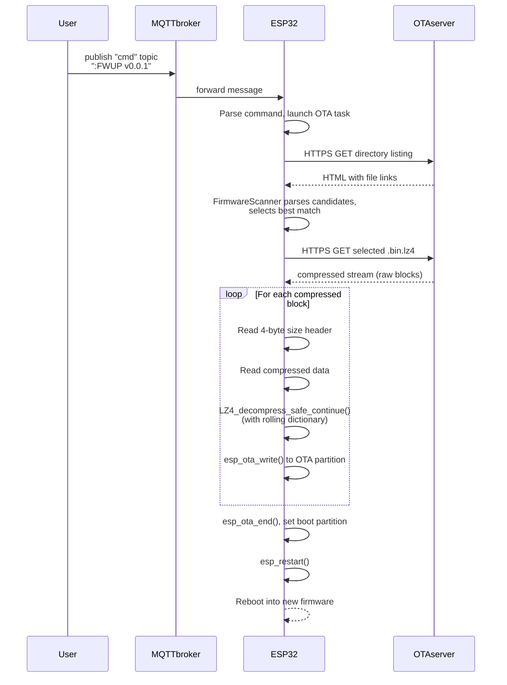

# ED_OTA Library: Over‑the‑Air Update Process & Test Guide

This document describes the OTA update system for the Pxxx project. It covers the test procedure using MQTT commands to switch between firmware versions (e.g., `v0.0.3` ↔ `v0.0.1`), the internal LZ4 decompression mechanism, and the server‑side file requirements. It also explains why incremental builds work correctly when changing Git tags, and the troubleshooting steps taken to ensure the LZ4 compression format matches the ESP32 decoder.

---

## 1. System Architecture

The OTA subsystem consists of:

- **OTA Server**: A network share (`//raspi00/fware/`) exposed via HTTPS, holding compressed firmware files (`.bin.lz4`).
- **ED_OTA library** (`ED_OTA.h` / `ED_OTA.cpp`): Manages firmware scanning, selection, download, LZ4 decompression, and flashing.
- **MQTT command interface**: Commands are sent to the `cmd` topic (e.g., `:FWUP v0.0.3`) to trigger updates.
- **Version management**: Git tags drive the version string; the build system and Python scripts propagate it consistently into the binary and the OTA file name.

The following sequence diagram illustrates the complete OTA flow.


```mermaid
sequenceDiagram
    participant User
    participant MQTTbroker
    participant ESP32
    participant OTAserver

    User->>MQTTbroker: publish "cmd" topic<br/>":FWUP v0.0.1"
    MQTTbroker->>ESP32: forward message
    ESP32->>ESP32: Parse command, launch OTA task
    ESP32->>OTAserver: HTTPS GET directory listing
    OTAserver-->>ESP32: HTML with file links
    ESP32->>ESP32: FirmwareScanner parses candidates,<br/>selects best match
    ESP32->>OTAserver: HTTPS GET selected .bin.lz4
    OTAserver-->>ESP32: compressed stream (raw blocks)
    loop For each compressed block
        ESP32->>ESP32: Read 4‑byte size header
        ESP32->>ESP32: Read compressed data
        ESP32->>ESP32: LZ4_decompress_safe_continue()<br/>(with rolling dictionary)
        ESP32->>ESP32: esp_ota_write() to OTA partition
    end
    ESP32->>ESP32: esp_ota_end(), set boot partition
    ESP32->>ESP32: esp_restart()
    ESP32-->>ESP32: Reboot into new firmware
```

---

## 2. Test Setup

### 2.1 Hardware
- **ESP32‑S3 Zero** (or any ESP32 with OTA partitions)
- Built‑in WS2812 LED on GPIO21 – visual feedback: red (patch 1), blue (patch 2), green (patch 3), white (default).

### 2.2 Network
- WiFi: `Edolis` (or your configured AP)
- MQTT broker at `192.168.1.220` (plain MQTT on port 1883 for testing) or `raspi00` (TLS on 8883 for production). The test command below uses the unencrypted port.

### 2.3 Firmware Files on the Server
The shared folder `\\raspi00\fware\` contains compressed images in **raw LZ4 block‑prefixed format** (not standard LZ4 frame). Examples:

```
Pxxx_v0.0.1-4-gbb20eb4-dirty.bin.lz4
Pxxx_v0.0.3-0-gbb20eb4-dirty.bin.lz4
```

These are produced by the post‑build script `compress_ota.py` using the `lz4.block` Python module with a rolling dictionary.

---

## 3. Version Propagation – No Clean Build Required

Changing a Git tag and rebuilding **does not need a full clean** because:

- **`PROJECT_VER`** is obtained at CMake configure time: `execute_process(git describe --tags --long --dirty --always)`. When the tag changes, CMake re‑evaluates the version, and the firmware’s `app_desc` is updated.
- **Compile definitions** `FW_FULL_HASH` and `FW_BUILD_ID` change with the commit hash or timestamp, forcing recompilation of `ED_sys.cpp`.
- **`main.cpp`** is modified by the pre‑build script `update_version_comment.py` using the exact version from CMake; the build system detects the file change and recompiles it.

Thus, after deleting a tag (e.g., removing `v0.0.3`, leaving only `v0.0.1`), a simple `idf.py build` suffices. The new firmware will reflect the correct version, and the OTA file will be named accordingly.

---

## 4. Triggering an OTA Update

### 4.1 MQTT Command Format
Publish to the topic `cmd`:

```
:FWUP <version>
```

- `:FWUP v0.0.3` – installs the latest firmware compatible with the given version prefix.
- `:FWUP` (without version) – installs the newest available firmware that matches the device’s current project name and has a higher version.

### 4.2 Test Command using `mosquitto_pub`

Use the following command to send an OTA update request (MQTT v3.1.1 over plain TCP):

```bash
mosquitto_pub -i "raspi_test_client" -h 192.168.1.220 -p 1883 \
  -u "usr" -P "pwd" -t "cmd" -m ":FWUP v0.0.3" -V mqttv311
```

Explanation:
- `-i`: client ID (any unique string)
- `-h`: MQTT broker host
- `-p`: broker port (1883 for non‑TLS)
- `-u` / `-P`: username / password
- `-t`: topic to publish to (`cmd`)
- `-m`: message payload (`:FWUP v0.0.3`)
- `-V mqttv311`: use MQTT protocol version 3.1.1

This triggers the device to scan for firmware matching `v0.0.3` and install it.

---

## 5. OTA Update Process in Detail

### 5.1 Command Reception
The `ED_MQTT_dispatcher` receives the message on the `cmd` topic, parses the command `FWUP`, and calls `OTAmanager::cmd_launchUpdate`. If a version target is present, it is passed to the OTA task.

### 5.2 Firmware Scanning
`ED_OTA::FirmwareScanner` fetches the HTTPS directory listing from `https://raspi00/fware/`. A regular expression extracts candidate filenames of the form:

```text
Pxxx_v<major>.<minor>.<patch>-<build>-g<hash>[-dirty].bin.lz4
```

The scanner compares each candidate against:
- The **current firmware version** (if no target specified) – it picks the highest version with a “compatible prefix”, meaning it locks the same major.minor.patch if they were locked from the reference.
- A **specific target version** (e.g., `v0.0.1`) – it locks major, minor, and patch to that target and looks for the highest build number.

The selected candidate’s filename is used to construct the full download URL.

### 5.3 Download
The file is downloaded over HTTPS. The HTTP client uses the ESP certificate bundle for TLS verification.

### 5.4 LZ4 Decompression
The downloaded file is **not** a standard LZ4 frame. It uses a **raw block‑prefixed format with a rolling dictionary**:

```text
[4 bytes LE compressed size] [compressed block]
[4 bytes LE compressed size] [compressed block]
...
```

- **Compressed block size**: up to 4096 bytes.
- **Decompressed block size**: up to 16384 bytes.
- **Rolling dictionary**: 16 KB maintained across blocks, exactly matching the compressor’s dictionary update.

Decompression steps:
1. `LZ4_createStreamDecode()` creates a stream.
2. For each block:
   - Read 4‑byte little‑endian size.
   - Read compressed data.
   - Call `LZ4_setStreamDecode()` with the current dictionary buffer (16 KB).
   - Call `LZ4_decompress_safe_continue()` to decompress into a 16 KB output buffer.
   - Write the decompressed data to the OTA partition with `esp_ota_write()`.
   - Update the dictionary by appending the decompressed data, rolling to the last 16 KB.

This raw streaming format was chosen for efficient streaming decompression without requiring the LZ4 frame header. The Python compression script `compress_ota.py` uses the `lz4.block` module with `dict=history` and `store_size=False` to produce exactly this format.

### 5.5 Flashing and Reboot
- After the file is fully decompressed and written, `esp_ota_end()` finalises the partition.
- `esp_ota_set_boot_partition()` marks the new partition as the boot target.
- `esp_restart()` triggers a software reset.
- The bootloader loads the new image from the OTA partition. If the image is valid, the new firmware runs.

---

## 6. LZ4 Compression Setup – Troubleshooting Note

During development, a mismatch between the compression script and the ESP32 decoder caused the error:

```text
E (31349) ED_OTA: Block too large: 407708164
```

The issue was traced to the use of the **standard `lz4` command‑line tool**, which produces a standard LZ4 frame (magic number `04 22 4D 18`). The ESP32 expected raw block‑prefixed data with a rolling dictionary.

**Fix**: A Python script (`compress_ota.py`) was written using the `lz4.block.compress` API with:

- `mode='high_compression'`
- `store_size=False` (no internal block size)
- `compression=9`
- `dict=history` (16 KB rolling dictionary)

This produces the raw stream exactly as required by the ESP32 decoder. The script also writes the 4‑byte little‑endian length before each compressed block.

Therefore, all firmware files on the server **must be generated by this script**; standard `.lz4` files will fail.

---

## 7. Testing Version Switching

### 7.1 Initial State
The device is running firmware with version `v0.0.3-...` (green LED). The server contains both `v0.0.3` and `v0.0.1` files.

### 7.2 Downgrade Test
Publish the downgrade command:

```bash
mosquitto_pub -i "raspi_test_client" -h 192.168.1.220 -p 1883 \
  -u "usr" -P "pwd" -t "cmd" -m ":FWUP v0.0.1" -V mqttv311
```

- The scanner locks major=0, minor=0, patch=1 and selects the file `Pxxx_v0.0.1-4-gbb20eb4-dirty.bin.lz4`.
- The device downloads and flashes the image.
- After reboot, the boot log shows: `App version: v0.0.1-4-gbb20eb4-dirty`.
- The LED turns red (patch = 1).

### 7.3 Upgrade Test
Publish:

```bash
mosquitto_pub -i "raspi_test_client" -h 192.168.1.220 -p 1883 \
  -u "usr" -P "pwd" -t "cmd" -m ":FWUP v0.0.3" -V mqttv311
```

- The device installs `v0.0.3` and returns to green.

No interruption of normal operation occurs during the download; the update is applied in the background and takes effect on reboot.

---

## 8. File Listing on the Server

The HTTPS server must return a directory listing containing anchor tags. A typical listing looks like:

```html
<html><body>
<a href="Pxxx_v0.0.1-4-gbb20eb4-dirty.bin.lz4">Pxxx_v0.0.1-4-gbb20eb4-dirty.bin.lz4</a>
<a href="Pxxx_v0.0.3-0-gbb20eb4-dirty.bin.lz4">Pxxx_v0.0.3-0-gbb20eb4-dirty.bin.lz4</a>
</body></html>
```

The scanner regex is:

```regex
href=\"(Pxxx_v([[:digit:]]+)\.([[:digit:]]+)\.([[:digit:]]+)-([[:digit:]]+)[^\"]*\.bin(\.[a-z0-9]+)?)\"
```

It captures the full filename, major, minor, patch, and build numbers.

---

## 9. Summary

- OTA updates are triggered by MQTT commands on the `cmd` topic.
- The device downloads compressed firmware files from an HTTPS server, decompresses them using a custom raw LZ4 streaming format with a rolling dictionary, and flashes the new partition.
- Version management is fully automated from Git tags, requiring no manual version strings.
- Incremental builds correctly update the version after tag changes without a full clean.
- The LZ4 compression is handled by the `compress_ota.py` script; standard `lz4` tools must not be used to create the OTA files.

Use the provided `mosquitto_pub` command to test version switching, and verify the behaviour via the LED colour and the serial boot log.